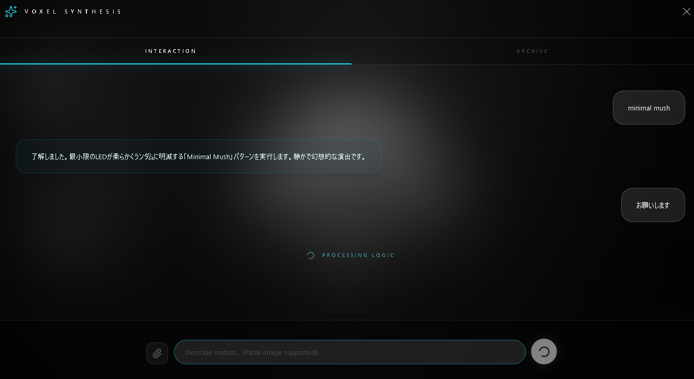
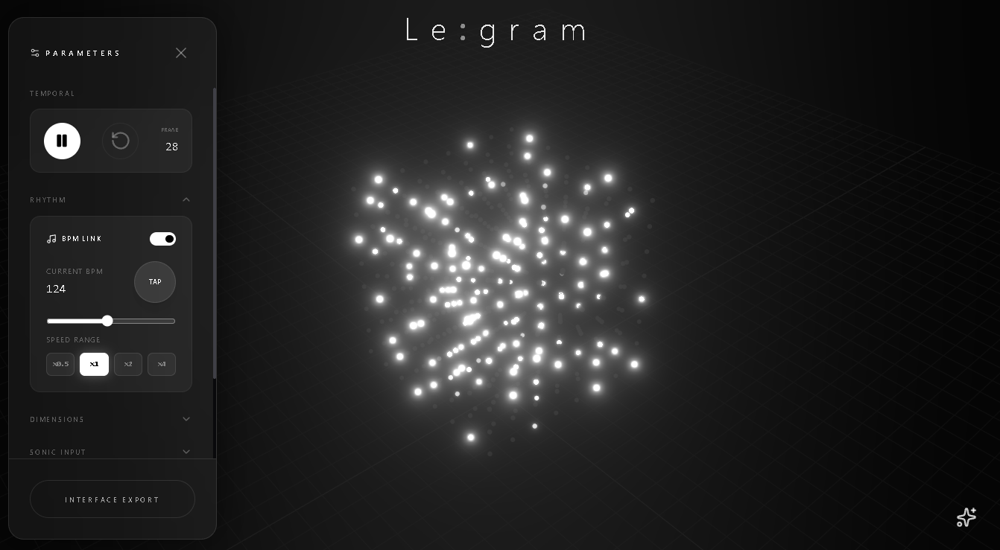

# Legram

[日本語](README_JP.md) | **English**


Legram is a professional-grade **AI-Powered Spatial Voxel Engine** powered by Google Gemini.
Beyond simple preset playback, it enables **real-time generation (coding) of 3D matrix patterns** from natural language prompts. It fuses CAD-like precision with dynamic data visualization.

## Key Features

### 🧠 AI Matrix Generation
The Gemini model functions as a "Voxel Engine Orchestrator," generating resolution-independent generative art.

<p align="center">
  
  
</p>
<p align="center">
  <em>Natural language prompt (left) and resulting matrix (right)</em>
</p>

- **Shader Mode**: AI generates mathematical logic like `Math.sin(nx * ...)`. It uses "Normalized Coordinates (0.0-1.0)" rendering, so patterns remain consistent regardless of Grid Size.
- **Particle Mode**: AI constructs particle systems with physics (gravity, velocity, lifetime). Behaviors like "Rain," "Explosion," and "Rise" can be commanded via natural language.

### 🎛️ Algorithmic Presets
A variety of built-in patterns ready for immediate use:
- **Wave**: Ripple effects utilizing phase shifting.
- **Pulse**: Energy pulses synchronized to the beat.
- **Rain / Fireworks / Fountain**: Physics-simulation-like effects.
- **DNA / Spiral**: Geometric rotating animations.

### 🎵 Audio Reactivity & BPM Sync
- **Microphone Input**: Real-time analysis of frequency bands visualized as 3D bars.
- **BPM Sync**: BPM setting via tap tempo and precise animation synchronization by bar units.

### 🛠️ Professional Control
- **JSON Editor**: Directly edit and save generated voxel data and AI responses.
- **Variable Grid Size**: Dynamically change resolution from 8x8x8 to 32x32x32 (or more) to match hardware performance.
- **CAD-like Operation**: Free camera movement (Orbit Controls) and intuitive parameter adjustments.

## Setup & Run

### Prerequisites
- Node.js installed.
- Gemini API Key obtained from Google AI Studio.

### Installation

1. Clone the repository and install dependencies.
   ```bash
   npm install
   ```

2. Create a `.env.local` file and set your Gemini API Key.
   ```bash
   GEMINI_API_KEY=your_api_key_here
   ```
   *(Note: Since this is a Vite environment, a `VITE_` prefix might be required depending on your configuration, but verified config uses `GEMINI_API_KEY` mapping)*

3. Start the application.
   ```bash
   npm run dev
   ```

## Tech Stack

- **Frontend**: React 19, TypeScript, Vite
- **3D Graphics**: Three.js (@react-three/fiber, @react-three/drei)
- **AI**: Google GenAI SDK (Gemini Pro/Flash)
- **Styling**: Tailwind CSS
- **Icons**: Lucide React

## License

[MIT License](LICENSE)
