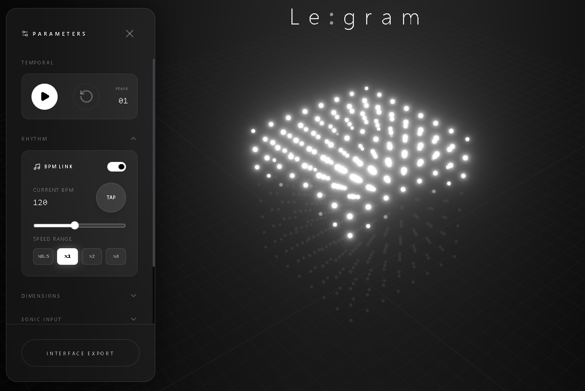

# Legram



Legram は、Google Gemini を搭載したプロフェッショナルグレードの **AI駆動型 空間ボクセルエンジン** です。
従来の「プリセット再生」だけでなく、自然言語プロンプトから **3Dマトリックスパターンをリアルタイムに生成（コーディング）** することが可能です。CADのような精密な操作感と、ダイナミックなデータ視覚化を融合させました。

## 主な機能

### 🧠 AI マトリックス・ジェネレーション
Gemini モデルが「Voxel Engine Orchestrator」として機能し、解像度に依存しないジェネレーティブ・アートを生成します。

- **Shader Mode (シェーダーモード)**: `Math.sin(nx * ...)` のような数式ロジックをAIが生成。解像度（Grid Size）が変わってもパターンが崩れない「Normalized Coordinates (0.0-1.0)」ベースのレンダリング。
- **Particle Mode (パーティクルモード)**: 物理演算（重力、速度、寿命）を持つパーティクルシステムをAIが構築。「雨」「爆発」「上昇」などの挙動を自然言語で指示可能。

### 🎛️ アルゴリズム・プリセット
即座に使用できる多様なビルトイン・パターン：
- **Wave**: 位相ズレを利用した波紋効果
- **Pulse**: ビートに同期するエネルギーパルス
- **Rain / Fireworks / Fountain**: 物理シミュレーションライクなエフェクト
- **DNA / Spiral**: 幾何学的な回転アニメーション

### 🎵 オーディオ・リアクティビティ & BPM Sync
- **マイク入力連動**: 周波数帯域をリアルタイムに解析し、3Dバーとして視覚化。
- **BPM Sync**: タップテンポによるBPM設定、および小節（Bar）単位での正確なアニメーション同期。

### 🛠️ プロフェッショナル・コントロール
- **JSON エディタ**: 生成されたボクセルデータやAIのレスポンスを直接編集・保存可能。
- **可変グリッドサイズ**: 8x8x8 から 32x32x32（あるいはそれ以上）まで、ハードウェア負荷に合わせて動的に解像度を変更可能。
- **CADライクな操作**: 自由なカメラワーク (Orbit Controls) と直感的なパラメータ調整。

## セットアップと実行

### 前提条件
- Node.js がインストールされていること。
- Google AI Studio で取得した Gemini API キー。

### インストール手順

1. リポジトリをクローンし、依存関係をインストールします。
   ```bash
   npm install
   ```

2. `.env.local` ファイルを作成し、Gemini API キーを設定します。
   ```bash
   VITE_GEMINI_API_KEY=your_api_key_here
   ```
   *(注意: Vite環境のため、接頭辞 `VITE_` が必要になる場合があります。コードベースの設定を確認してください)*

3. アプリケーションを起動します。
   ```bash
   npm run dev
   ```

## 技術スタック

- **Frontend**: React 19, TypeScript, Vite
- **3D Graphics**: Three.js (@react-three/fiber, @react-three/drei)
- **AI**: Google GenAI SDK (Gemini 1.5 Pro/Flash)
- **Styling**: Tailwind CSS
- **Icons**: Lucide React

## ライセンス

[MIT License](LICENSE)
